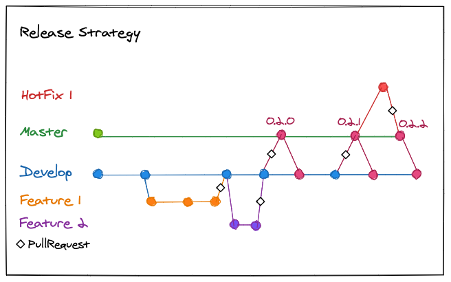

# Contributing to Epimetheus

As an open source project, Epimetheus welcomes contributions of many forms.

Examples of contributions include:

*   Code patches
*   Documentation improvements
*   Bug reports and patch reviews

Patches can be submitted as pull requests, but if you don't file an issue, it may be ignored. Please file an issue to suggest changes.

## Branch naming and commit messages
Please start a new branch name with ```feature```, ```bug``` or ```hotfix``` depending on the type of the issue, and then add the related issue's number. The rest of the branch’s name should be short and descriptive.<br>
**Example:**
>```“feature/21-more-documentation”```

Commit messages should always start with the number of the issue that they're related to. Please avoid commits that are not related to any issue.
- If you have a small fix that's somehow related to the current issue on hand, feel free to fix it as well.
- If your fix isn't related to the issue, consider creating a new issue and create a different pull request.
- If you have a small fix that's **not** related to the issue and decide to fix it anyway, please remember to mention it in the issue's or pull request's description.
- Small and general fixes like correcting a typo or updating the documentation don't require an issue number.

## Pull requests
Before making a pull request, please rebase the local branch to the [```develop```](https://github.com/salabs/Epimetheus/tree/develop) branch and squash any unnecessary commits.

Pull request's title should contain the related issue's number, and the pull request should be linked to the related issue.

Pull request requires one approval before it’s possible to merge. The pull request is merged by the reviewer, but in case there are only little improvements to be done after the first review, the reviewer can give an approval beforehand and after the fixes have been done, the pull request’s creator can merge it.

If the individual commits add value to the history and you want to keep all of them, please use the **“Rebase and merge”** option when merging the pull request.

If the individual commits **don't** add value to the history, please use the **"Squash and merge"** option to squash the commits into a single commit when merging the pull request.

Branches should be automatically deleted after they are merged.

## Coding style
Epimetheus project uses [EditorConfig](https://editorconfig.org/) to manage the coding style. See the [.editorconfig](/.editorconfig) file
for settings.

## Release strategy
Project uses semantic versioning, and all the pull requests are first created in to ```develop``` branch. Releases are done regularly when there are new commits in the development branch. The releases are done with a merge commit that has release version numbering in semantic order (Major, Minor, Patch) (Semantic versioning: <https://semver.org/>)



## Step-by-step example of contributing
1. Checkout to ```develop``` branch:
```
git checkout develop
```
2. Checkout to a new branch and name it according to the issue's type and number:
```
git checkout -b <issuetype/issuenumber-description>
```
3. Commit changes with a clear and descriptive note that starts with the issue number:
```
git add
git commit -m "issuenumber - description of changes"
```
4. Sync with ```develop``` branch:
```
git checkout develop
git pull
```
5. Rebase the ```develop``` branch into the local branch. Use ```--interactive/--i``` flag to reword or squash commits:
```
git checkout <issuetype/issuenumber-description>
git rebase develop
```
6. Push the local branch:
```
git push
```
7. Create a pull request and follow the given guidelines. Make sure the ```base``` is set to ```develop```.
